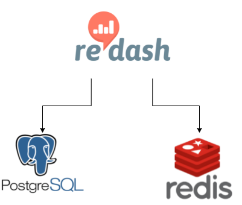

# Redash One Node

This example sets up a single instance of Redash.

## Modules in use
| Modules       | version       |
| ------------- |:-------------:|
| [terraform-nomad-redis](https://github.com/skatteetaten/terraform-nomad-redis) | 0.1.0 |
| [terraform-nomad-postgres](https://github.com/skatteetaten/terraform-nomad-postgres) | 0.4.1 |

## Services

Source code: https://github.com/getredash/redash