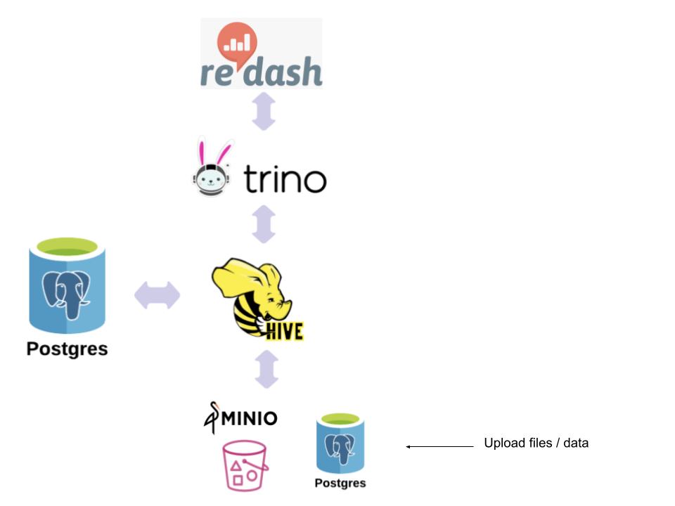

# Redash uses Trino as a datasource

This example deploys a Redash cluster connected to a [Trino in standalone mode](https://github.com/Skatteetaten/terraform-nomad-trino/tree/master/example/trino_standalone) as a datasource.

## Prerequisites
### Docker image
Image used in this example named `gitlab-container-registry.minerva.loc/datainn/redash-rabbit-edition:latest` 
is customized to support Trino. At the moment (date: 26.05.21) there does not exist any offical and stabile version 
of [Redash image](https://hub.docker.com/r/redash/redash/tags?page=1&ordering=last_updated) supporting Trino. 


### Vault provider
If you are running the example with Vault provider, Vault K/V store should contain all required credentials and policies.
In this example, all required actions are automated by Ansible. See the following files for details.

- Required policy [01-create-vault-policy-to-read-secrets.yml](../../dev/vagrant/bootstrap/vault/post/01-create_vault_policy_to_read_secrets.yml)
- Required credentials [00_generate_secrets_vault.yml](../../dev/ansible/00_generate_secrets_vault.yml)

### Datasource
Datasources in Redash can be added automatcally by customizing the configuration.
Below is an example of how Trino as a datasource can be configured (from [redash_trino_cluster/main.tf](/main.tf)):
```terraform
# Customized redash configuration 
redash_config_properties = [
"python /app/manage.py ds new \"trino\" --type \"trino\" {\"catalog\":\"hive\", \"host\":\"127.0.0.1\", \"port\":\"8080\", \"schema\":\"default\", \"username\":\"trino\"  }"
]

# Datasource upstream. Trino must exists as a service in the cluster.
datasource_upstreams = [{ service_name = module.trino.trino_service_name, port = 8080 }]
```


## Modules in use
| Modules       | version       |
| ------------- |:-------------:|
| [terraform-nomad-redis](https://github.com/skatteetaten/terraform-nomad-redis) | 0.1.0 |
| [terraform-nomad-postgres](https://github.com/skatteetaten/terraform-nomad-postgres) | 0.4.1 |
| [terraform-nomad-trino](https://github.com/skatteetaten/terraform-nomad-trino) | 0.4.0 |
| [terraform-nomad-minio](https://github.com/skatteetaten/terraform-nomad-minio) | 0.4.0 |
| [terraform-nomad-hive](https://github.com/skatteetaten/terraform-nomad-hive) | 0.4.0 |

## Services



Source code: https://github.com/getredash/redash


