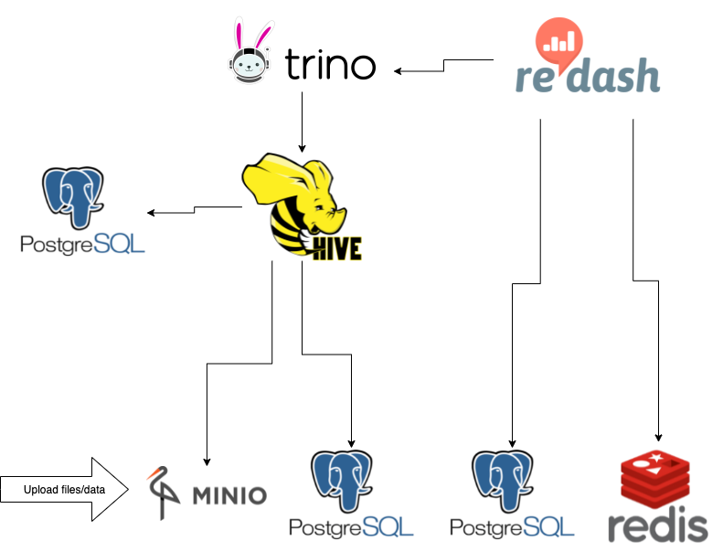

# Redash uses Trino as a datasource

This example deploys a Redash cluster connected to a [Trino in standalone mode](https://github.com/Skatteetaten/terraform-nomad-trino/tree/master/example/trino_standalone) as a datasource.

